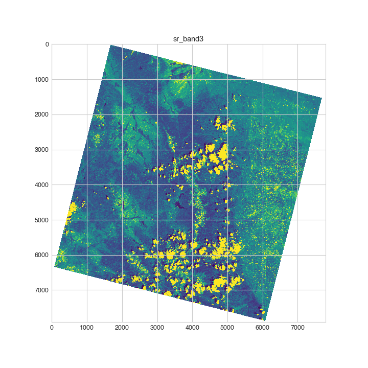

# ESPA Tools

[](https://pypi.org/project/espatools/) [](https://travis-ci.org/OpenGeoVis/espatools)

An open-source Python package for simple loading of Landsat imagery as NumPy arrays

## Install

`espatools` is available from [PyPI](https://pypi.org/project/espatools/):

```bash
$ pip install espatools
```

## Usage

We think `espatools` is easy to use; give it a try and let us know what you think!

See [this Jupyter Notebook](https://github.com/OpenGeoVis/espatools/blob/master/Example.ipynb) for a demonstration of some simple plotting after reading Landsat imagery.

```py
# Import the espatools module for raster I/O
import espatools
# Use matplotlib for simple plotting
import matplotlib.pyplot as plt

# Set the XML metadata file
xmlfile = 'LC081210652018073101RT-SC20180802013328/LC08_L1TP_121065_20180731_20180731_01_RT.xml'
# Set up the reader
reader = espatools.RasterSetReader(filename=xmlfile)
# Perfrom the read!
raster = reader.Read()

```

That's it! you just read in a set of Landsat imagery and each band is accessible by name as a 2D NumPy array:

```py
# Get the bands dictionary
bands = raster.bands
# Grab a band by name
aer = bands.get('sr_aerosol')

# Plot this band up!
plt.imshow(aer.data)
plt.title(aer.name)
plt.show()
```

The above code results in an image like below:




```py
# Maybe you want the RGB bands as a 3D NumPy array
color = raster.GetRGB()

# You could plot this up:
plt.figure()
plt.imshow(color)
plt.title('color')
plt.show()

```


